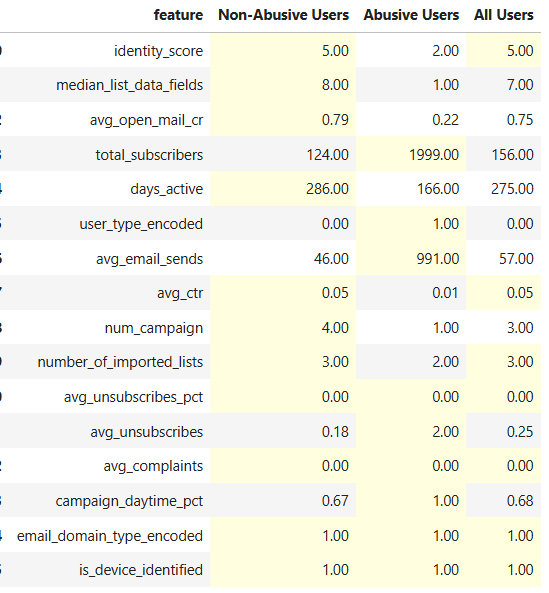
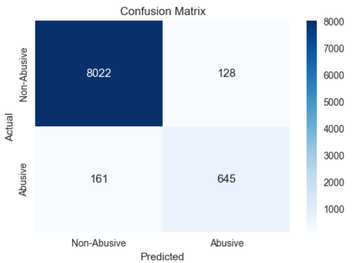

# Project Title: Abusive User Detection in Marketing Campaigns

## Goals of the Project
This project aims to identify abusive users in marketing campaigns based on historical engagement data. By detecting abusive users, we can enhance system security, prevent fraudulent activities, and optimize marketing effectiveness.

## Data Sources Used
The project utilizes the following datasets:
- **users.csv**: Contains user-level attributes such as identity scores and email domain types.
- **campaigns.csv**: Includes data on user interactions with email marketing campaigns, such as email sends, opens, clicks, unsubscribes, and complaints.

## Data Overview
### 1. Users Data (users.csv)
This dataset contains information about registered users, including:
- `user_id`: Unique identifier for users
- `identity_score`: Score representing the trustworthiness of a user
- `user_type_encoded`: Categorical encoding of user type
- `email_domain_type_encoded`: Categorical encoding of email domain type
- `is_device_identified`: Boolean indicating whether a user's device is identified
- `abusive_flag`: Boolean label indicating whether a user is abusive

### 2. Campaigns Data (campaigns.csv)
This dataset records user engagement with marketing campaigns, including:
- `user_id`: Unique identifier linking to users.csv
- `number_of_imported_lists`: Number of imported email lists
- `total_subscribers`: Number of subscribers in email campaigns
- `email_sends`: Total emails sent
- `unique_opens`: Unique email opens
- `unique_clicks`: Unique clicks on email links
- `unsubscribes`: Users who unsubscribed
- `complaints`: Complaints raised against the campaign

## 3. Data Processing Steps
1. **Feature Engineering**:
   - Aggregated campaign data by user using sum operations to create a one-to-one mapping between users and engagement features (eg: num_campaign, avg_ctr...)
   - Converted the target column `abusive_flag` from boolean to numeric (1 for abusive, 0 for non-abusive).
2. **Merging Datasets**:
   - The `users.csv` and `campaigns.csv` datasets are merged on `user_id` to obtain a consolidated view.
3. **Handling Missing Values**:
   - Replaced missing values in campaign-related features with 0, assuming users who didn’t engage have 0 interactions.
4. **EDA to highlight Abusive Users' Behavior**:
   - Using RandomforestCalssificator to find out features importance list
   - Using median value to compare between abusive and non-abusive users to remove oulier effect.
5. **Data Splitting**:
   - The dataset was split into an 80% training set and a 20% test set using stratified sampling to maintain class balance.
6. **Model Training**:
   - Used PyCaret’s AutoML to train multiple models and select the best based on precision.
   - Fine-tuned the best model using hyperparameter optimization.
7. **Evaluation**:
   - Evaluated the model using a confusion matrix and classification report.
   - Analyzed feature importance to understand key characteristics of abusive users.

## 4. Tools and Technologies Applied
- **Python**: Feture engineering, EDA and modeling

## 5. Key Insights Discovered

- Users with high `identity_score` tend to be non-abusive (The **identity_score** for abusive users is only **2.00**, whereas non-abusive users have a median score of **5.00**)
- Abusive users show significantly lower `number_of_campaign` (**num_campaign** (number of campaigns) is **1.00** for abusive users, compared to **4.00** for non-abusive users) and shorter day active.
- `unsubscribes` and `unique_clicks` are important indicators of abusive behavior:
	* **avg_unsubscribes** is **2.00** for abusive users, while non-abusive users only have **0.18**
	* **avg_ctr (click-through rate)** is **0.01** for abusive users, compared to **0.05** for non-abusive users.  
- Abusive users have a higher number of `total_subscribers` in their campaigns (Abusive users have a **median total_subscribers of 1999**, compared to only **124 for non-abusive users**).

## 6. Hypotheses Based on Insights
- Users generating excessive complaints and unsubscribes may indicate fraudulent or spam-like behavior.
- Users with unusually high `identity_score` are likely legitimate and less abusive.
- Campaigns with high engagement but also high complaints may be misleading or deceptive.

## 7. Model Result:

| Actual \ Predicted | Non-Abusive | Abusive |
|--------------------|------------|---------|
| **Non-Abusive**    | 8,022      | 128     |
| **Abusive**        | 161        | 645     |

- **False Positives:** 128 (Non-abusive users misclassified as abusive)
- **False Negatives:** 161 (Abusive users misclassified as non-abusive)

### Key Takeaways
- The model prioritizes **precision over recall**, meaning it aims to **minimize false positives** (incorrectly flagging non-abusive users as abusive).  
- **Precision for abusive users is 83%**, ensuring that most flagged abusive users are indeed abusive.  
- **Some abusive users (161) are missed**, but this is acceptable given the focus on **avoiding misclassifying legitimate users**.  
- This approach is ideal when **false accusations are more costly than missing some abusive users** (e.g., fraud detection where wrongly banning a good user is worse than missing a few bad ones).  
## 8. Recommendations Based on Analysis Results
1. **Stricter Monitoring for High-Complaint Users**:
   - Implement early warnings for users exceeding a threshold of 5 complaints within a single campaign or 10 complaints across multiple campaigns.
2. **Enhanced Verification for New Users**:
   - Require additional verification steps for users with low historical engagement.
3. **Adaptive Campaign Restrictions**:
   - Limit campaign reach for users with high unsubscribe rates until further validation.
4. **Cold Start Problem Handling**:
   - Train a separate model for new users who lack sufficient engagement data.
   - Focus on static attributes like `identity_score` and registration details.
   - Transition users to the main model once enough data is accumulated.

## 9. Model Testing & Validation Before Deployment
- **Cross-Validation**: Performed k-fold validation to ensure model stability.
- **A/B Testing**: Implement an A/B test with a control group before rolling out model-based decisions.
- **Live Monitoring**: Continuously track precision and recall post-deployment.
- **Business Stakeholder Feedback**: Validate the model with domain experts to align with business objectives.

